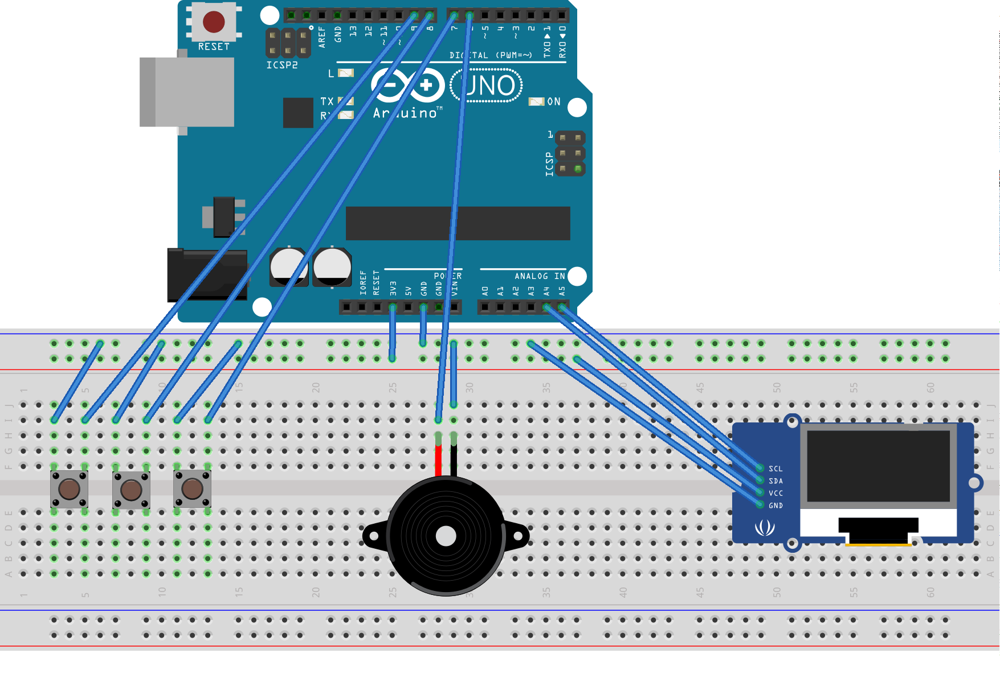
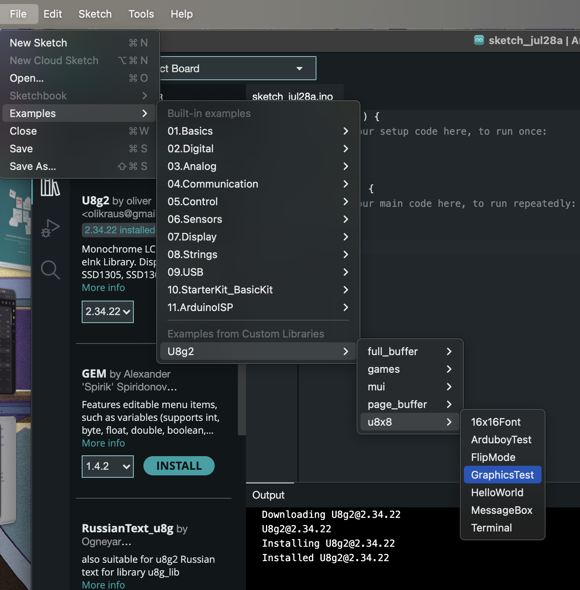

# STEM-for-girls-zmigrod

The project of we did in the Stem for Girls workshop in Zmigrod, is based on the parts and diagrams described in the [Tamaguino](https://alojzjakob.github.io/Tamaguino/#hardware) project by Alojz Jakob.

Our version is using `without resistors, with active LOW`, and the picture below shows the setup of cables and pieces, the display is different to the one in the diagram, but the name of the pins on the display are the same:



To quickly test the display connection, open [buzzer.ino](https://github.com/ArtesEdu/stem4dziewczynek/blob/main/buzzer/buzzer.ino) from the [ArtesEdu/stem4dziewczynek](https://github.com/ArtesEdu/stem4dziewczynek) repository, there are other examples available too, you can browse the repository, this is the code we used in the workshop.

To enable the display in a new project, two lines are required:

``` example
#include <U8g2lib.h>   // imports the u8g2 library for the display 

U8G2_SH1106_128X64_NONAME_F_HW_I2C u8g2(U8G2_R0, U8X8_PIN_NONE); // enables the library under the u8g2 alias 
                                                                 // this could also be display to make it more natural
```

To upload the code and program the BarbieKomputerek ~~arduino board~~ with the new [firmware (link in polish)](https://pl.wikipedia.org/wiki/Oprogramowanie_sprz%C4%99towe) we need to download first the [Arduino IDE](https://www.arduino.cc/en/software) and there is also a cloud version. 

## Arduino IDE Download and Setup

When downloading, and prompted for donation, either donate or click "Just download", if you have the google translate extension and it gets translated automatically, the button will not show up, but it is there ;). If you can spare the money, donate, but is not required.


After the IDE is installed, connect the BarbieKomputerek, and click on `Select Board`:


In the next screen, search for `Arduino UNO` or type it in the search bar, if the board is connected, the port should also show up, (`COMX` for windows, `/dev/ttyUSBX` and `/dev/cu.xxx` for MacOS). If the port does not show up, try the cloud version (I am not sure if it's going to work, but let us know).


To download the library for the display, click on `Sketch -> Include Library`


When the library manager shows up, look for `u8g2` by Oliver


To quickly test the display connection, open [buzzer.ino](https://github.com/ArtesEdu/stem4dziewczynek/blob/main/buzzer/buzzer.ino) from the [ArtesEdu/stem4dziewczynek](https://github.com/ArtesEdu/stem4dziewczynek) repository, there are other examples available too, you can browse the repository, this is the code we used in the workshop.

There are also examples available for the display, and in the basics too for blinking with leds, etc:



Examples with the display need to have the following line, before the `setup()` function, usually found at line `#79` of the display examples, commented by `//`, delete the `//` to enable it.:

```
U8G2_SH1106_128X64_NONAME_F_HW_I2C u8g2(U8G2_R0, U8X8_PIN_NONE); // enables the library under the u8g2 alias
```

Now you can start hacking!
Happy hacking, 
hack the planet!